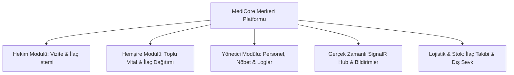

# 🏥 MediCore Klinik & Bakım Yönetim Sistemi
## Proje Tanıtım, Mimari ve Yönetici Sunum Dokümanı

> **Proje Kapsamı**: T.C. Cumhurbaşkanlığı İletişim Başkanlığı / Staj Geliştirme Programı  
> **Geliştirici**: Ahmet Taha EROL  
> **Teknoloji Yığını**: .NET 9 Web API + React (Vite) + SignalR + EF Core + SQLite  
> **Versiyon**: 1.0.0 (Production-Ready)

---

## 📌 1. YÖNETİCİ ÖZETİ (EXECUTIVE SUMMARY)

**MediCore**, modern sağlık ve bakım merkezlerinin (klinikler, huzurevleri, rehabilitasyon ve palyatif bakım merkezleri) operasyonel süreçlerini dijitalleştirmek, hasta güvenliğini en üst düzeye çıkarmak ve sağlık personeli arasındaki koordinasyonu gerçek zamanlı (real-time) sağlamak amacıyla geliştirilmiş yeni nesil bir **Klinik & Bakım Yönetim Bilgi Sistemi**dir.

Sistem; hasta kabulünden hekim vizitelerine, toplu vital bulgu takibinden barkodlu ilaç dağıtım süreçlerine, personel nöbet çizelgelerinden hastane dışı sevk operasyonlarına kadar tüm döngüyü tek bir entegre platformda toplar.



---

## 🎯 2. HEDEF VE PROBLEM TANIMI

### Karşılaşılan Problemler:
- **Manuel ve Kağıt Bazlı Süreçler**: Vital bulguların ve hemşire notlarının kağıt üzerinde tutulması sonucu oluşan veri kaybı ve geç aksiyon alma riskleri.
- **İlaç Dağıtım Hataları**: Saatlik ilaç uygulamalarının eksik veya mükerrer yapılması riski.
- **İletişim Kopukluğu**: Vardiya değişimlerinde bilgi aktarımının yetersiz kalması.
- **Nöbet ve Görev Karmaşası**: Personel çizelgelerinin ve görev atamalarının şeffaf yönetilememesi.

### MediCore Çözümü:
- **Sıfır Hata Politikası**: Saat bazlı, renk kodlu ilaç dağıtım matrisi ve anlık vital eşik kontrolleri.
- **Gerçek Zamanlı Uyarılar**: SignalR WebSocket altyapısı ile kritik hasta alarmları ve anlık duyurular.
- **Rol Tabanlı Denetim (RBAC)**: Başhekim, Hekim ve Hemşire rollerine özel izole edilmiş dashboard'lar.
- **Şeffaf Vardiya Devri**: Dijital vardiya raporları ve otomatik nöbet çakışma kontrolleri.

---

## 🏗️ 3. TEKNİK MİMARİ VE TEKNOLOJİ YIĞINI

| Katman | Teknoloji / Kütüphane | Açıklama |
| :--- | :--- | :--- |
| **Backend API** | .NET 9 (C# ASP.NET Core Web API) | Yüksek performanslı, asenkron ve modüler RESTful servis mimarisi. |
| **Veri Tabanı & ORM**| Entity Framework Core & SQLite | Hızlı sorgulama, hafif dağıtım ve ilişkisel veri bütünlüğü. |
| **Gerçek Zamanlı İletişim**| ASP.NET Core SignalR (WebSockets) | Çift yönlü, anlık bildirim, acil durum ve duyuru akışı. |
| **Frontend** | React 18 & Vite | Ultra hızlı yükleme (Vite SPA), bileşen tabanlı modern arayüz. |
| **Tasarım & UI** | TailwindCSS & Modern Vanilla CSS | Geist font ailesi, Dark/Light tema desteği, monokrom & modern sağlık estetiği. |
| **Kimlik & Güvenlik** | JWT Bearer Authentication & BCrypt | Token tabanlı stateless oturum yönetimi ve güçlü şifreleme. |
| **Loglama & İzlenebilirlik** | Serilog & Rolling File Logs | Detaylı HTTP istek logları ve sistem denetim izleri (Audit Trail). |

---

## 👥 4. KULLANICI ROLLERİ VE ERİŞİM MATRİSİ (RBAC)

```
┌─────────────────────────────────────────────────────────────┐
│                    KULLANICI ROLLERİ                         │
├───────────────────┬───────────────────┬─────────────────────┤
│ 👑 BAŞHEKİM/ADMIN │ 🩺 HEKİM (DOKTOR)  │ 💉 HEMŞİRE/PERSONEL │
├───────────────────┼───────────────────┼─────────────────────┤
│ • Personel İK     │ • Hasta Muayene   │ • Toplu Vital Girişi│
│ • Nöbet Çizelgesi │ • Vizite Notları  │ • İlaç Dağıtımı     │
│ • Sistem Logları  │ • İlaç Tedavisi   │ • Hemşire Notları   │
│ • Genel Raporlar  │ • Hastane Sevki   │ • Günlük Görevler   │
│ • Duyuru Yönetimi │ • Hasta Geçmişi   │ • Vardiya Devir     │
└───────────────────┴───────────────────┴─────────────────────┘
```

---

## 🚀 5. TEMEL MODÜLLER VE ÖNE ÇIKAN ÖZELLİKLER

### 1. 📊 Akıllı Dashboard & Durum Takibi
- Rol bazlı özelleşen ana paneller.
- Klinik doluluk oranı, kritik durumdaki hastalar, bekleyen sevkler ve yaklaşan ilaç saatleri özeti.

### 2. 🩺 Hekim Vizite & Muayene Modülü
- Hastaya ait anamnez, tanı, fiziki muayene bulguları ve tedavi protokolleri.
- Geçmiş vizite kayıtlarının kronolojik akışı.

### 3. 💓 Toplu Vital Bulgu Girişi & Alarm Sistemi
- Tek ekrandan tüm servisteki hastaların **Tansiyon, Nabız, Ateş, SPO2 ve Solunum** değerlerinin girilmesi.
- Kritik eşik değerlerinde (örn: SPO2 < 90, Ateş > 38.5°C) otomatik görsel ve sesli alarmlar.

### 4. 💊 İlaç Dağıtım Paneli & Stok Yönetimi
- Sabah, Öğle, Akşam ve Gece periyotlarında hastaların alacağı ilaçların saatlik matrisi.
- Tek tıkla "Uygulandı", "Hasta Reddetti" veya "Ertelendi" durum yönetimi.
- Kritik seviyeye inen ilaçlar için otomatik stok uyarıları.

### 5. 🚑 Hastane Dış Sevk & Takip Modülü
- İleri tetkik veya acil müdahale gereken hastaların dış hastanelere sevki.
- Sevk gerekçesi, hedef hastane, refakatçi personel, ambulans durumu ve geri dönüş takibi.

### 6. 📅 Vardiya, Nöbet Takvimi & Devir Teslim
- İnteraktif aylık takvim üzerinde hekim ve hemşire nöbet atamaları.
- Nöbet değişimlerinde kritik hasta durumlarını aktaran **Dijital Vardiya Devir Raporu**.

### 7. 🔔 SignalR ile Canlı Bildirim & Acil Anons Sistemi
- Sayfa yenilemeye gerek kalmadan anlık duyuru yayını ve kritik hasta değişiklik bildirimleri.

### 8. 🛡️ Sistem Güvenliği & Audit Logları
- Sistemdeki her kritik işlemin (hasta kaydı, ilaç onayı, personel değişikliği) kullanıcı, zaman ve IP bazlı izlenmesi.

---

## 📈 6. PROJENİN SAĞLADIĞI KAZANIMLAR (ROI & ETKİ)

1. **Zaman Tasarrufu**: Toplu vital girişi ve dijital ilaç matrisi sayesinde hemşirelerin evrak işlerinde %60'a varan zaman tasarrufu.
2. **Sıfır İlaç Atlama**: Saatlik hatırlatıcılar ve renkli durum göstergeleri ile ilaç uygulama hatalarının minimize edilmesi.
3. **Şeffaf Yönetim**: Başhekim ve klinik yöneticileri için tek tıkla kurumun anlık doluluk, personel ve finansal/stok durumunun izlenebilmesi.
4. **Hızlı ve Güvenilir Sevk**: Dış hastaneye sevk edilen hastaların anlık takibi ile koordinasyon gecikmelerinin önüne geçilmesi.

---

## 🖥️ 7. SUNUM SLAYT PLANI (ÖNERİLEN 10 SLAYT)

- **Slayt 1**: Kapak — MediCore: Yeni Nesil Klinik & Bakım Yönetim Sistemi
- **Slayt 2**: Problem & Motivasyon — Sağlık ve bakım merkezlerinde yaşanan operasyonel zorluklar
- **Slayt 3**: Vizyon & Çözüm — Bütünleşik, gerçek zamanlı ve hatasız dijital dönüşüm
- **Slayt 4**: Sistem Mimarisi — .NET 9, React Vite, EF Core, SignalR ve Serilog
- **Slayt 5**: Rol Tabanlı Erişim — Başhekim, Doktor ve Hemşire panelleri
- **Slayt 6**: Öne Çıkan Özellik 1 — Toplu Vital Girişi & Renk Kodlu Erken Uyarı Sistemi
- **Slayt 7**: Öne Çıkan Özellik 2 — Saatlik İlaç Dağıtım Matrisi & Stok Alarmları
- **Slayt 8**: Öne Çıkan Özellik 3 — Dış Hastane Sevk Takibi & Nöbet/Vardiya Yönetimi
- **Slayt 9**: Canlı Demo & Güvenlik — SignalR anlık bildirimler, JWT & Test Başarı Oranı (%100)
- **Slayt 10**: Kapanış & Soru-Cevap — Projenin geleceği ve kurumsal entegrasyon potansiyeli

---

## 📞 8. İLETİŞİM & PROJE KÜNYESİ

- **Proje**: MediCore Clinical Care System
- **Geliştirici**: Ahmet Taha EROL
- **Staj Kurumu**: T.C. Cumhurbaşkanlığı
- **Tarih**: 2026
