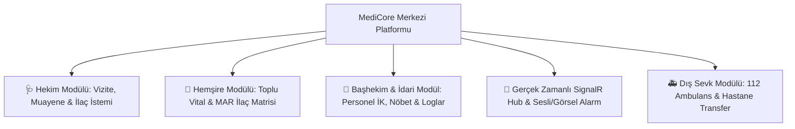

# 🏥 MediCore — Yeni Nesil Klinik & Hasta Bakım Yönetim Bilgi Sistemi

<div align="center">


-success?style=for-the-badge&logo=checkmarx&logoColor=white)

<p align="center">
  <b>T.C. Cumhurbaşkanlığı Staj Programı Kapsamında Geliştirilmiş Entegre Klinik ve Palyatif Bakım Otomasyonu</b>
</p>

</div>

---

## 📌 1. Proje Genel Bakışı (Executive Summary)

**MediCore**, modern sağlık ve bakım merkezlerinin (huzurevleri, rehabilitasyon, geriatri ve palyatif bakım merkezleri) operasyonel klinik süreçlerini dijitalleştirmek, hasta güvenliğini en üst düzeye çıkarmak ve sağlık çalışanları arasındaki bilgi akışını **gerçek zamanlı (SignalR WebSockets)** sağlamak amacıyla geliştirilmiş kapsamlı bir **Klinik & Bakım Yönetim Bilgi Sistemi (KBS)**'dir.

Sistem; hasta kabulünden hekim vizitelerine, saatlik ilaç dağıtım matrisinden toplu vital bulgu erken uyarı sistemine, personel nöbet takviminden 112 dış hastane sevk operasyonlarına kadar tüm sağlık döngüsünü tek bir platformda toplar.



---

## 🎯 2. Temel Modüller ve Yetenekler

### 1. 📊 Rol Tabanlı Akıllı Dashboard'lar (RBAC)
* **Başhekim Paneli:** Kurum yatak doluluk oranı, kritik hasta uyarıları, yaklaşan nöbetler, aktif sevkler ve anlık aktivite akışı.
* **Kurum Hekimi Paneli:** Bekleyen viziteler, kritik vital alarmları, reçete durumu ve poliklinik takibi.
* **Hemşire Paneli:** Saatlik ilaç teslim süreleri, servis sakinlerinin son vital durumları ve günlük klinik görevler.
* **İdari Yönetici Paneli:** Salt okunur denetim, nöbet/kadro izleme ve sistem aktivite logları.

### 2. 💊 Saatlik İlaç Dağıtım Matrisi (Medication Administration Record - MAR)
* **Sabah (08:00)**, **Öğle (13:00)**, **Akşam (19:00)** ve **Gece (22:00)** periyotlarına göre otomatik ayrıştırılan hasta bazlı ilaç çizelgesi.
* Tek tıkla *Uygulandı*, *Hasta Reddetti* veya *Ertelendi (Neden Belirterek)* durum yönetimi.
* Renk kodlu uyarılar ve kritik stok limitine inen ilaçlar için otomatik depo uyarıları.

### 3. 💓 Toplu Vital Girişi & Gerçek Zamanlı Sesli Alarm Sistemi
* Tüm servisteki bakım sakinlerinin **Ateş, Nabız, Büyük/Küçük Tansiyon, SpO2 (Oksijen) ve Solunum** değerlerinin tek matriste seri girişi.
* **Kritik Eşik Kontrolleri:**
  * Nabız < 50 BPM *(Bradikardi)* veya > 120 BPM *(Taşikardi)*
  * Ateş < 35.0°C *(Hipotermi)* veya > 38.5°C *(Yüksek Ateş)*
  * Büyük Tansiyon < 90 mmHg *(Hipotansiyon)* veya > 150 mmHg *(Hipertansiyon)*
  * SpO2 < %90 *(Hipoksi / Kritik Solunum)*
* **Web Audio API & SignalR:** Dış ağ bağımlılığı olmaksızın tarayıcı üzerinden anında **3 kademeli tıbbi monitör sesli alarmı** ve anlık Toast bildirimi üretimi.

### 4. 🩺 Hekim Vizite & Muayene Yönetimi
* Şikayet, fizik muayene bulguları, tanı (ICD-10 uyumlu) ve tedavi planı kayıtları.
* Hastaya özel geçmiş muayene kartları ve kronolojik sağlık geçmişi.

### 5. 🚑 Dış Hastane Sevk & 112 Koordinasyonu
* İleri tetkik ve acil sevk gereken hastaların hastane, doktor notu, ambulans durumu ve refakatçi takibi.
* Hastaneden geri dönüş kabulü ve taburculuk / durum güncelleme döngüsü.

### 6. 📅 Vardiya, Nöbet Takvimi & Dijital Teslim Raporu
* İnteraktif takvim üzerinde hekim ve hemşire nöbet planlaması.
* Nöbet değişimlerinde kritik hasta durumlarını sonraki ekibe aktaran **Dijital Vardiya Raporu**.

### 7. 🛡️ Tam Denetim İzi (Audit Trail)
* Sistemde gerçekleştirilen her kritik işlem (hasta kaydı, silme, ilaç onayı, sevk başlatma) kullanıcı adı, rolü, işlem türü, detay açıklaması ve IP adresi ile loglanır.

---

## 🏗️ 3. Teknik Mimari ve Teknoloji Yığını

| Katman | Teknoloji / Kütüphane | Kullanım Amacı |
| :--- | :--- | :--- |
| **Backend API** | **.NET 9 (C# ASP.NET Core Web API)** | Asenkron, yüksek performanslı RESTful servis katmanı. |
| **ORM & Veritabanı** | **Entity Framework Core 9 & SQLite** | WAL (Write-Ahead Logging) modunda concurrency kilitlenmesiz ilişkisel veritabanı. |
| **Gerçek Zamanlı İletişim** | **ASP.NET Core SignalR** | Çift yönlü WebSocket bildirim hattı (`/hub/klinik`). |
| **Frontend Framework** | **React 19 & Vite** | Code-splitting, lazy-loaded rotalar ve ultra hızlı SPA deneyimi. |
| **Tasarım & UI** | **Tailwind CSS & Lucide Icons** | Özel klinik renk paleti, Dark/Light tema motoru ve duyarlı (responsive) tasarım. |
| **Ses & Alarm Motoru** | **Web Audio API (Synthesizer)** | Dış dosya bağımlılığı olmadan %100 yerel üretilen medikal alarm tonları. |
| **Kimlik & Güvenlik** | **JWT Bearer & BCrypt.Net** | Claim bazlı Rol Yetkilendirmesi (RBAC) ve güvenli şifreleme. |
| **Test Altyapısı** | **xUnit & Fluent Assertions** | Medikal algoritmaları ve iş mantığını doğrulayan 32 adet otomatik birim testi. |

---

## 🚀 4. Kurulum ve Çalıştırma Rehberi

Projeyi yerel ortamınızda ayağa kaldırmak için aşağıdaki adımları izleyebilirsiniz:

### 📋 Ön Gereksinimler
* **[.NET 9.0 SDK](https://dotnet.microsoft.com/download/dotnet/9.0)**
* **[Node.js (v18 veya üzeri)](https://nodejs.org/)** & npm

---

### Adım 1: Backend API'yi Başlatma
```bash
# API klasörüne geçiş yapın
cd MediCore.API

# Bağımlılıkları yükleyin ve API'yi çalıştırın
dotnet run --launch-profile http
```
* **API Adresi:** `http://localhost:5034`
* **Swagger UI (İnteraktif Dokümantasyon):** `http://localhost:5034/swagger`
* *(Not: İlk çalıştırmada `DbInitializer` otomatik devreye girerek örnek hastaları, ilaçları ve personelleri SQLite veritabanına yükler).*

---

### Adım 2: Frontend Arayüzünü Başlatma
```bash
# UI klasörüne geçiş yapın (yeni bir terminalde)
cd MediCore.UI

# Paketleri yükleyin
npm install

# Geliştirici sunucusunu başlatın
npm run dev
```
* **Uygulama Arayüzü:** `http://localhost:5173/`

---

## 👥 5. Demo Kullanıcı Hesapları

Giriş ekranında yer alan **"Hızlı Rol Seçimi"** butonları ile tek tıkla giriş yapabilir veya aşağıdaki hesap bilgilerini kullanabilirsiniz:

| Rol | Kullanıcı Adı / E-Posta | Şifre | Erişim Yetkileri |
| :--- | :--- | :--- | :--- |
| 👑 **Başhekim / Admin** | `admin` *(veya `dr_aterol`)* | `123` *(veya `admin123`)* | Tüm modüller, personel İK, nöbet yönetimi, sistem logları |
| 🩺 **Kurum Hekimi** | `dr_moz` *(veya `dr_arcan`)* | `123` | Vizite, muayene, reçete, hasta detay, sevk |
| 💉 **Başhemşire / Hemşire** | `hem_bashemsire` *(veya `hem_fyildiz`)* | `123` | Toplu vital, saatlik ilaç dağıtımı, teslim raporu, görevler |
| 📋 **İdari Yönetici** | `yonetici_denetci` | `123` | İzleme/Denetim panelleri, duyurular, görev panosu |

---

## 🧪 6. Otomatik Birim Testleri (Unit Tests)

Backend iş kuralları ve medikal algoritma doğrulamaları için yazılmış testleri çalıştırmak için:

```bash
# Proje ana dizininden doğrudan:
dotnet test

# Veya test projesinin içerisinden:
cd MediCore.Tests
dotnet test
```

**Test Kapsamı:**
* `VitalEvaluatorTests`: Kritik vital bulgu eşiklerinin ve alarm kurallarının doğrulanması.
* `ValidationHelperTests`: T.C. Kimlik No algoritması, telefon ve girdi doğrulama kuralları.
* `AktiviteLogTests`: Audit trail kayıt oluşturma ve yetki denetimleri.

```
Başarılı! - Başarısız: 0, Başarılı: 32, Toplam: 32 (Geçme Oranı: %100)
```

---

## 📁 7. Dizin Yapısı

```
MediCore/
├── MediCore.API/             # .NET 9 Web API Katmanı
│   ├── Controllers/          # REST API Uç Noktaları (17 Controller)
│   ├── Data/                 # AppDbContext & DbInitializer (Seed Data)
│   ├── Entities/             # Veritabanı Varlık Modelleri (17 Entity)
│   ├── Helpers/              # AuditLogger, VitalEvaluator, ValidationHelper
│   ├── Hubs/                 # SignalR KlinikHub WebSocket Servisi
│   └── Program.cs            # Uygulama Başlangıç & Servis Yapılandırması
│
├── MediCore.UI/              # React 19 + Vite Frontend Katmanı
│   ├── public/               # Kurumsal Vektörel ve PNG Logolar
│   └── src/
│       ├── components/       # Modüler Sayfa Bileşenleri (Dashboard, MAR, Vital vb.)
│       ├── context/          # AuthContext, NotificationContext, ToastContext
│       ├── utils/            # sound.js (Web Audio API Motoru), exportUtils
│       └── App.jsx           # Ana Yönlendirme, SignalR Dinleyicisi & Tema
│
├── MediCore.Tests/           # xUnit Otomatik Birim Testleri Projesi
│   ├── VitalEvaluatorTests.cs
│   ├── ValidationHelperTests.cs
│   └── AktiviteLogTests.cs
│
├── MediCore.sln              # Master Visual Studio / .NET Solution Dosyası
├── .gitignore                # Git Hariç Tutma Yapılandırması
└── README.md                 # Proje Dokümantasyonu
```

---

## 👨‍💻 Proje Künyesi & İletişim

* **Geliştirici:** Ahmet Taha EROL
* **Kurum:** T.C. Cumhurbaşkanlığı
* **Proje Sürümü:** `v1.0.0 (Production-Ready)`
* **Geliştirme Tarihi:** 2026
